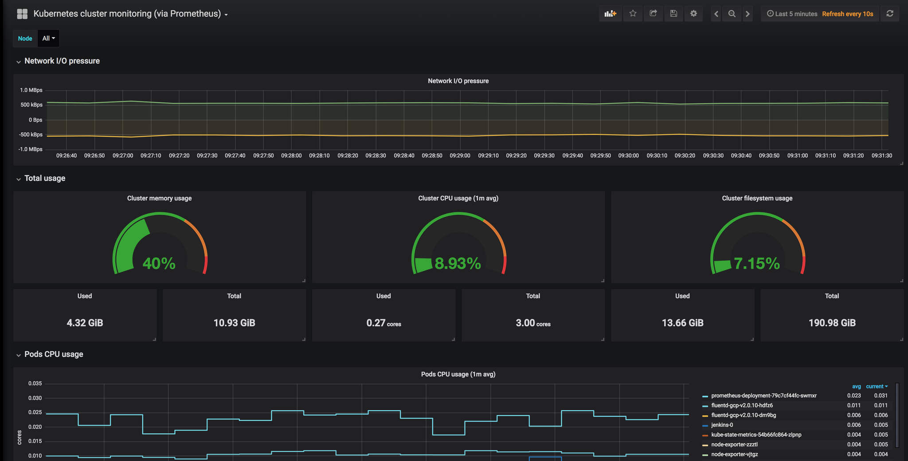

> ## This Repo Is No Longer Maintained

# gke-metrics
Prometheus based metrics setup for Kubernetes on Google



## 1. Requirements

1. Running Kubernetes cluster
2. `kubectl` configured to use it.

## 2. Setup

1. Create required binding (required only for Google Kubernetes engine):
```
export GCLOUD_USER=your_email_on_gcloud
kubectl create clusterrolebinding "$GCLOUD_USER-cluster-admin-binding" --clusterrole=cluster-admin --user=$GCLOUD_USER
```

**Please note!** If you have ```Legacy authorization	Enabled``` on your cluster master, the above rolebinding will not work. Instead add Kuberentes Cluster Admin privilage to your active account from **IAM & admin  -> [your user account] -> Kubernetes Cluster Admin.**
Login again with ```gcloud auth login``` and initiate your cluster connection again (you have a **connect** button in the console right next to the cluster)

2. Create monitoring namespace
```
kubectl create ns monitoring
```
Why: to avoid mixing with business containes and for easy removal if needed.

3. Create configmap for Prometheus:
```
kubectl apply -f prometheus-configmap.yml -n monitoring
```

4. Create node exporters and kube-state-metrics from coreos:
```
kubectl apply -f exporters.yml -n monitoring
```

5. Create Prometheus and proper roles:
```
kubectl apply -f prometheus.yml -n monitoring
```

6. Create grafana for dashboard:
```
kubectl apply -f grafana.yml -n monitoring
```

## 3. Dashboards

1. Get grafana url or ip:
```
kubectl get svc -n monitoring | grep grafana
```

2. Login with `admin/admin` to ip/url found in previous step.

3. Add datasource:
type: prometheus
url: http://prometheus-k8s:9090
access: proxy

4. Import dashboard:
- use `+` -> import on the left panel
- type dashboard id `1621`
- change datasource type to prometheus
- save

Note: if grafana is on public url/ip, change default password!

## 4. Authors

- [Eryk Zalejski](https://github.com/ezalejski)

- [Filip Haftek](https://github.com/filiphaftek)

- [Ferencz Farkas](https://github.com/WhiteWolf99)

- [Christoph Rosse](https://github.com/gries)
